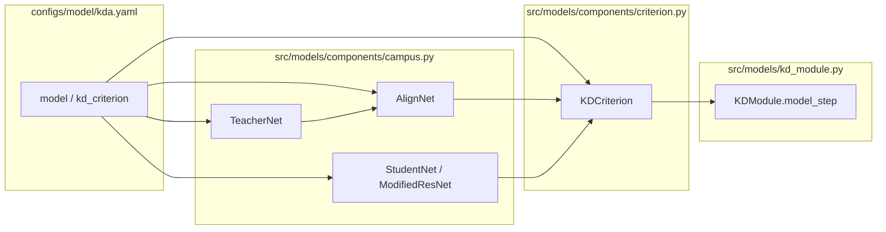

# コード構成（VL2Lite）

リポジトリのフォルダ構成と、**知識蒸留まわりを改良するときに触るべき場所**をまとめたものです。

---

## リポジトリ全体のイメージ

```
VL2Lite/
├── configs/                 # Hydra 設定（学習の組み立てはほぼここ）
├── src/                     # 学習・評価のエントリとモデル／データの実装
├── tests/                   # pytest
├── scripts/                 # 補助スクリプト
├── data/                    # データ置き場（通常は kd_datasets 以下。README 参照）
├── docs/                    # 補助ドキュメント
├── requirements.txt
├── setup.py
└── README.md
```

---

## `configs/` — 実験の「つまみ」

Hydra が `configs/train.yaml` を根にマージします。KD の挙動を変えるときに触ることが多いものだけ抜粋します。

| パス | 役割 |
|------|------|
| `train.yaml` | ルート設定。`defaults` で `data` / `model` / `trainer` / `logger` などを選択。`train` / `test` フラグ。 |
| `model/kda.yaml` | **`KDModule` と `TeacherStudent` の具象化**。optimizer、scheduler、`use_teacher`、`use_img_kd` / `use_txt_kd`（L_vis / L_txt アブレーション）、`align_num_layers`、`kd_criterion` の損失種・温度・クラス数など。 |
| `data/kd_data.yaml` | データモジュールの土台。`batch_size`、`num_workers`。 |
| `data/attributes/*.yaml` | **データセットごとのメタ情報**（`name`、`class_num`、`classes`、`prompt_tmpl`）。**テキストプロンプトの形**はここ＋ Teacher の tokenizer が蒸留の言語側に効く。 |
| `trainer/*.yaml` | CPU/GPU/DDP、エポック数など。 |
| `callbacks/default.yaml` | Early stopping / checkpoint の監視メトリクス（例: `val/acc`）。 |
| `experiment/ablation_*.yaml` | 損失アブレーション用プリセットなど。 |
| `logger/*.yaml` | CSV / TensorBoard / local / wandb など。 |
| `paths/default.yaml` | `data_dir`・`log_dir` などパス。 |
| `hydra/default.yaml` | 実行ごとの出力ディレクトリ（`logs/train/runs/...`）。 |

**改良のヒント（設定だけで試せること）**: 損失のオンオフ、投影層の深さ、学習率・スケジュール、温度、データセット・プロンプト、batch /  trainer。

---

## `src/` — 実装の置き場

| パス | 役割 |
|------|------|
| `train.py` | 学習エントリ。`trainer.fit` → （設定どおり）`trainer.test`。KD のアルゴリムそのものはここではなく **`KDModule` に集約**。 |
| `eval.py` | チェックポイントだけ評価するエントリ（`configs/eval.yaml` ベース。必要に応じ `data` / `model` を KD 用に override）。 |
| `train_ablation.sh` | 複数アブレーションを連続実行するシェル例。 |

---

## 知識蒸留を改良するときに重点的に触る部分

以下は **アルゴリズム・損失・Teacher/Student・中間表現**をいじるときの中心経路です。矢印は典型的なデータ／勾配の流れです。



### 1. 学習ループと損失の合成 — `src/models/kd_module.py`

- **`KDModule`** が Lightning の `training_step` / `validation_step` / `test_step` を実装。
- **`model_step`** が 1 バッチの損失の中心。
  - **分類損失**（`CrossEntropyLoss`）と、Teacher あり時の **L_vis（`img_loss`）・L_txt（`kd_loss`）** を合成。
  - **エポック依存の重み** `loss_schedule`（`configs/model/loss_schedule/`、詳細は `docs/loss_schedule.md`）。
  - **`use_img_kd` / `use_txt_kd`** によるアブレーション分岐もここ。

**改良例**: 重み付けスケジュールの変更、損失の足し方（平均以外）、補助損失の追加、メトリクスログの追加。

---

### 2. 蒸留用の損失定義 — `src/models/components/criterion.py`

- **`KDCriterion`** が Teacher–Student の中間テンソルから **L_vis（画像特徴の整列）** と **L_txt（画像–言語類似度の KL 蒸留）** を計算。

**改良例**: L1 の他に MSE / cosine、温度・`logit_scale`、クラス数スケール、別の蒸留ターゲットへの差し替え。

---

### 3. ネットワーク構造（Teacher / 投影 / Student）— `src/models/components/campus.py`

| クラス | 役割 | 改良しやすい点 |
|--------|------|----------------|
| **`TeacherNet`** | OpenCLIP で画像・テキストエンコード。Teacher は **勾配オフ**。`forward` は正規化済み画像特徴。 | CLIP の `arch` / `pretrained` は **`configs/model/kda.yaml` の `net.teacher`**。テキストは凍結で一括エンコードされ `frozen_nlp_features` に保存。 |
| **`AlignNet`** | **コンデンセーション（投影）層**: Teacher 次元 → Student 特徴次元。画像用・言語用で別モジュール。 | **`align_num_layers`**（1 層 / 2 層 MLP）や層構成の変更はここ。共有ヘッド化なども同ファイル。 |
| **`StudentNet` / `ModifiedResNet`** | ResNet から **中間特徴**と **分類 logits** を取得（Teacher 使用時）。 | Student のバックボーン、`fc` まわり、特徴次元はここがソース。 |

**改良例**: 投影層の幅・正則化、Residual / LayerNorm の追加、Student を ViT 等に差し替える際の I/O 形状合わせ。

---

### 4. データとプロンプト — `src/data/` と `configs/data/attributes/`

| パス | 役割 |
|------|------|
| `src/data/components/kd_dataloader.py` | **`KDDataset`** と各ベンチマーク用 Dataset クラス。**画像前処理**（Augmentation）は `get_transform`。新データセット追加時は **`get_dataloader` の分岐**と属性 YAML の追加が必要になる。 |
| `src/data/kd_datamodule.py` | **`KDDataModule`**: train/val/test _dataloader。**注意**: val と test は設定上どちらも **同じ `split: test` データ**を指す実装になっている。 |

**改良例**: 拡張の強さ、別 split の導入、クラス記述（`prompt_tmpl`）の多様化 — 後者は **`configs/data/attributes/*.yaml`** と `classes`。

---

### 5. Hydra でのモデル配線 — `configs/model/kda.yaml`

- **`_target_: src.models.kd_module.KDModule`** に optimizer / scheduler、`use_teacher`、フラグ、`net`、`kd_criterion` が渡る。
- **`net` → `TeacherStudent`** の引数はここで列挙されるため、**Python 側の `__init__` に引数を足したら YAML も更新**する。

---

## 触る頻度が低いが関連するもの

| パス | 内容 |
|------|------|
| `src/utils/instantiators.py` | callback / logger のインスタンス化。 |
| `src/utils/logging_utils.py` | ハイパーパラメータログ。 |
| `configs/callbacks/*.yaml` | **どのメトリクスで ckpt・early stop するか**（例: `val/acc`）。損失名を変えたら要確認。 |
| `tests/test_train.py` など | 設定や学習スモークテスト。大きな API 変更時に更新。 |

---

## 最短チェックリスト（蒸留まわりをいじるとき）

1. 損失の式・重み → `kd_module.py` の `model_step`（＋必要なら `criterion.py`）。
2. L_vis / L_txt の中身のみ → `criterion.py`。
3. Teacher の強さ・凍結テキストの作り方 → `campus.py` の `TeacherNet` + `get_frozen_nlp_features`、および **`data/attributes/*.yaml` の `prompt_tmpl` / `classes`**。
4. 投影（コンデンセーション）の構造 → `campus.py` の `AlignNet`、`kda.yaml` の `align_num_layers`。
5. Student の表現力 → `campus.py` の `StudentNet` / `ModifiedResNet`、`kda.yaml` の `net.student`。
6. 実験パラメータだけ試す → **`configs/model/kda.yaml`** と **`configs/data/attributes/*.yaml`**。

この順で「式 → ブロック → 設定」と辿ると、改修の影響範囲を切り分けやすくなります。
